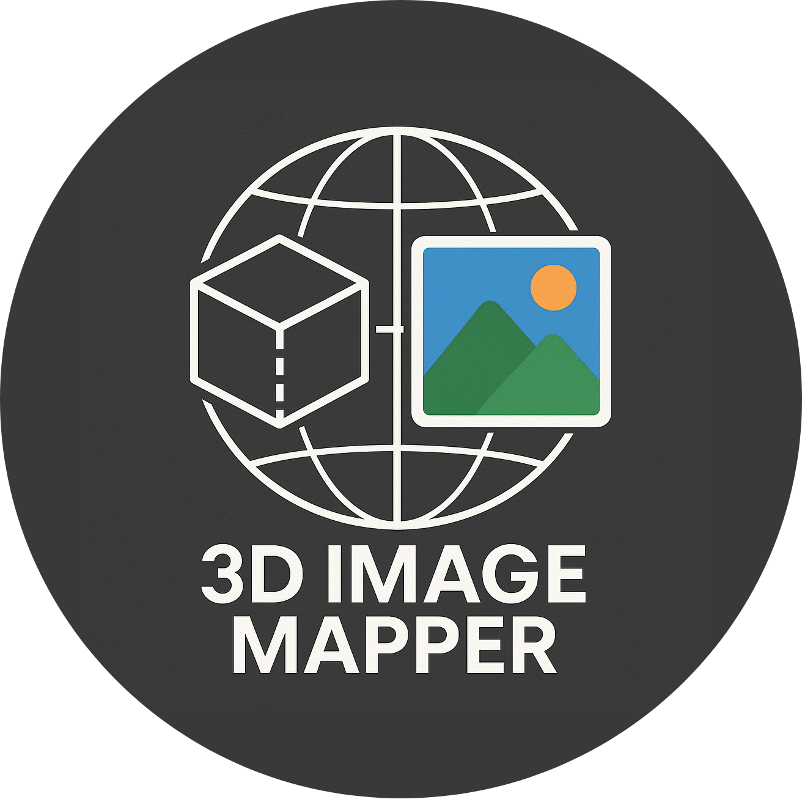

<p align="center">
  </img>
</p>

---

<p align="center">


<br>


</p>

<div align="center">
<h1>🗺️ 3D Image Mapper</h1>
Questo progetto è una web app in fase di sviluppo per la visualizzazione di tour panoramici 3D con dati di nuvole di punti.<br>
Sviluppato per l'esame di <b>Computer Graphics e Multimedia</b> (2024/2025) presso l'Università Politecnica delle Marche, docente Prof. Primo Zingaretti.<br>
Realizzato da <a href="https://github.com/nicolobartolinii">Nicolò Bartolini</a> e <a href="https://github.com/oathbound-01">Alessandro Rossini</a>.<br>
</div>

---

# 🇬🇧 [English version (versione inglese)](README.md)

# 📋 Indice

- [🎯 Panoramica del progetto](#-panoramica-del-progetto)
- [🚀 Avvio rapido](#-avvio-rapido)
- [🛠️ Strumenti utilizzati](#-strumenti-utilizzati)
- [👥 Autori](#-autori)
- [📄 Licenza](#-licenza)

# 🎯 Panoramica del progetto

3D-Image-Mapper è uno strumento web per esplorare tour panoramici 3D usando immagini panoramiche e dati di nuvole di punti. Il progetto è ancora in sviluppo e serve come dimostrazione tecnica per il corso di Computer Graphics e Multimedia.

**Funzionalità principali (WIP):**
- Visualizzazione di immagini panoramiche mappate su nuvole di punti 3D
- Navigazione tra le diverse tappe del tour
- Supporto VR di base (Three.js WebXR)
- Dati caricati da dataset forniti (vedi `public/datasets/`)

# 🚀 Avvio rapido

> **Nota:** Il progetto è in fase di sviluppo. Le istruzioni potrebbero cambiare.

1. **Clonare il repository:**
   ```bash
   git clone https://github.com/oathbound01/3D-Image-Mapper
   cd 3D-Image-Mapper
   ```
2. **Installare le dipendenze:**
   ```bash
   npm install
   ```
3. **Creare le tappe del tour virtuale:**
   - Inserire le immagini panoramiche e i file delle nuvole di punti nella cartella `public/datasets/` secondo la struttura richiesta.
   - Inserire il file di posa (formato TXT) e il file di allineamento CAM (formato CSV) nella cartella `public/datasets/`.
   - Inserire i dati dei parametri intrinseci nella cartella `public/datasets/params/Cam_to_Cam/` (formato NPY).
   - Usare gli script forniti per convertire o generare i dati del tour:
   ```bash
   npm run build:tour
   ```
4. **Avviare il server di sviluppo:**
   ```bash
   npm run dev
   ```
5. **Aprire il browser:**
   Visitare [http://localhost:5173](http://localhost:5173) (o la porta indicata nel terminale).

# 🛠️ Strumenti utilizzati

- [Three.js](https://threejs.org/) (rendering 3D WebGL)
- [Vite](https://vitejs.dev/) (dev server e build tool)
- [JavaScript](https://developer.mozilla.org/it/docs/Web/JavaScript)
- [Python](https://www.python.org/) (per gli script di preprocessing dati)

# 👥 Autori

- [Nicolò Bartolini](https://github.com/nicolobartolinii) (Matricola 1118768)
- [Alessandro Rossini](https://github.com/oathbound-01) (Matricola 1119002)

# 📄 Licenza

[Licenza GNU GPL](LICENSE)

Copyright © 2025 Nicolò Bartolini, Alessandro Rossini 