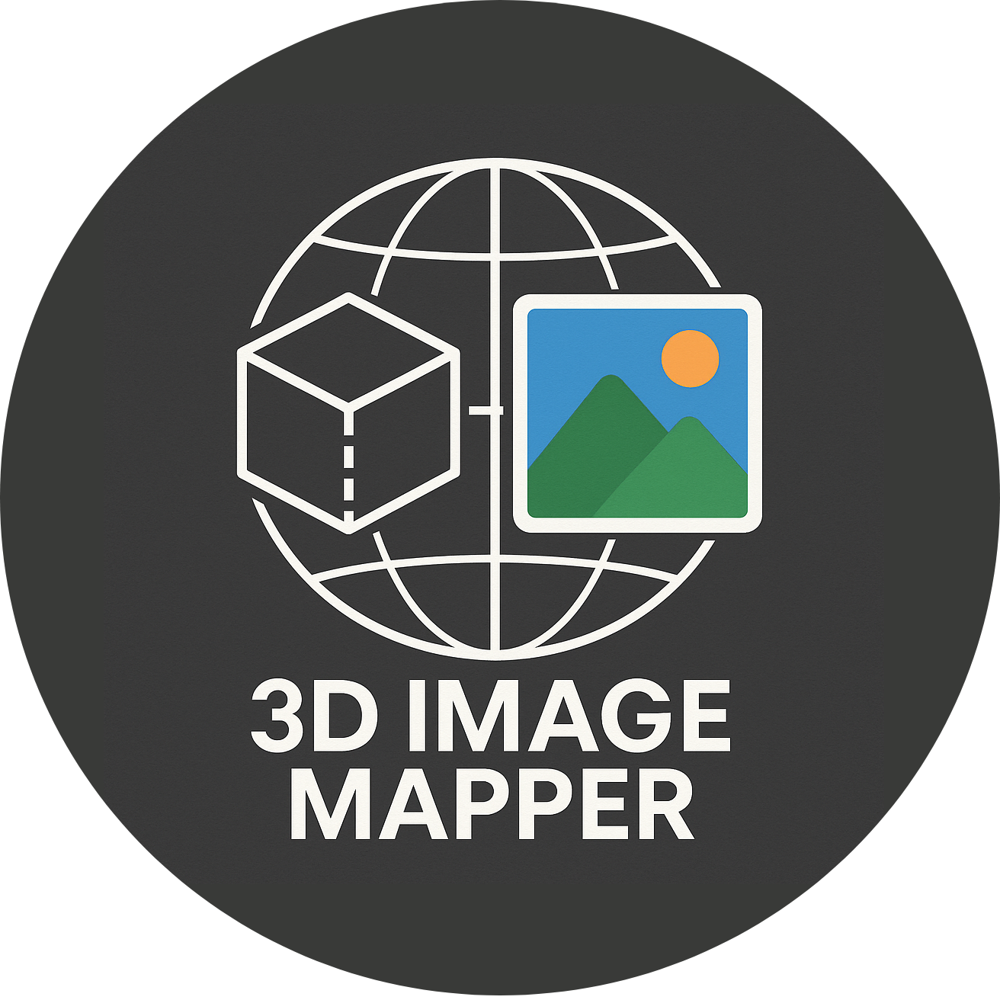

<p align="center">
  </img>
</p>

---

<p align="center">


<br>


</p>

<div align="center">
<h1>🗺️ 3D Image Mapper</h1>
This project is a framework for setting up and visualizing 3D panoramic tours with point cloud data.<br>
Developed for the <b>Computer Graphics e Multimedia</b> exam (2024/2025) at Università Politecnica delle Marche, led by Prof. Primo Zingaretti.<br>
Built by <a href="https://github.com/nicolobartolinii">Nicolò Bartolini</a> and <a href="https://github.com/oathbound-01">Alessandro Rossini</a>.<br>
</div>

---

# 🇮🇹 [Versione italiana (Italian version)](README-it.md)

# 📋 Table of contents

- [🎯 Project overview](#-project-overview)
- [🚀 Quick start](#-quick-start)
- [🛠️ Tools used](#-tools-used)
- [👥 Authors](#-authors)
- [📄 License](#-license)

# 🎯 Project overview

3D Image Mapper is a web-based framework for creating and exploring 3D panoramic tours using point cloud and panoramic image data. The project is intended as a technical demonstration for the Computer Graphics e Multimedia course.

**Main features :**
- Point cloud to panoramic image alignment tool
- Navigation between different tour stops
- Basic VR support with WebXR
- Data-driven from provided datasets (see `public/datasets/`)

# 🚀 Quick start

1. **Clone the repository:**
   ```bash
   git clone https://github.com/oathbound01/3D-Image-Mapper
   cd 3D-Image-Mapper
   ```
2. **Install dependencies:**
   ```bash
   npm install
   ```
3. **Create the virtual tour:**
   - Place your panoramic images in the `public/datasets/stitching/` directory and point cloud files in the `public/datasets/pcd/` directory.
   - Place two `list.json` files in both of the previous directories. These files must only contain an array with the filenames of the imahes and PCDs that will be used for the tour. The tool will then pair the image and PCD files with the same indices in the arrays. Example: 
   ```js
   ["0000.png", "0054.png", "0108.png", "0162.png", "0216.png", "0269.png"]
   ```
   In this case, `0000.png` will be paired with the first PCD in its respective `list.json` array, `0054.png` will be paired with the second PCD file etc...
4. **Run the development server:**
   When all relevant data is placed in its respective location, run this command to start the application proper:
   ```bash
   npm run dev
   ```
5. **Open your browser:**
   - Visit [http://localhost:5174](http://localhost:5174) (or the address shown in your terminal).
   - Use the *Alignment tool* to sync up the panorama/pcd pair
   - Add any relevant hotspots to the scene for navigation between stops
   - Export your `alignments.json` once everything is finished and place it in the `public/` folder

   </img>

6. **Test out the virtual tour:**

   Once everything is done, simply navigate back to the main page of the browser-based application and select the *View tour* options to try it out.

   

   You can enter VR mode by clicking the *ENTER VR MODE* button.

   NOTE: VR-based navigation between scenes is only supported using headsets that use controllers.

# 📊 Test Dataset

In order to build, test and debug this framework we've used panoramic images and PCD data from the [PAIR360 dataset](https://airlabkhu.github.io/PAIR-360-Dataset/) by the Kyung Hee University AIRLAB. This dataset is available under the [Open Database License](https://opendatacommons.org/licenses/odbl/1-0/). Parts of this dataset are included in this project's files to provide examples of this framework's functionalities. The paper detailing the contents of their dataset can be found [at this link](https://ieeexplore.ieee.org/document/10679919)

# 🛠️ Tools used

- [JavaScript](https://developer.mozilla.org/en-US/docs/Web/JavaScript)
- [Three.js](https://threejs.org/) (WebGL 3D rendering)
- [Vite](https://vitejs.dev/) (development server and build tool)
- [WebXR](https://immersiveweb.dev) (XR integration)

# 👥 Authors

- [Nicolò Bartolini](https://github.com/nicolobartolinii) (Matricola 1118768)
- [Alessandro Rossini](https://github.com/oathbound01) (Matricola 1119002)

# 📄 License

[GNU GPL License](LICENSE)

Copyright © 2025 Nicolò Bartolini, Alessandro Rossini